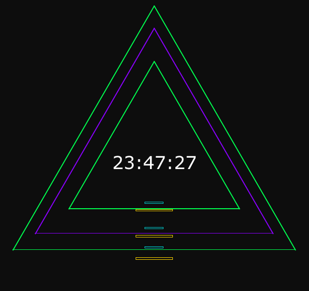
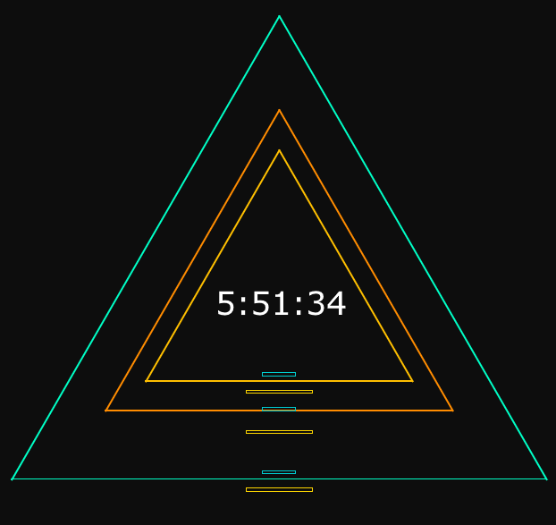

# Triangular Clock
- [English](#English)
- [Italiano](#Italiano)
## Examples
23:47:27            |  5:51:34
:-------------------------:|:-------------------------:
  |  

## English
This project is a dynamic and colorful clock implemented with HTML, CSS, and JavaScript. It displays the current time with animated triangles, each representing hours, minutes, and seconds.

### Triangles:
Each triangle representing hours, minutes, and seconds is dynamically colored based on the current time.

### Customization:
You can customize the colors and sizes of the clock by modifying the CSS variables in the style.css file.

Questo progetto è un orologio dinamico e colorato implementato con HTML, CSS e JavaScript. Visualizza l'ora corrente con triangoli animati, ognuno rappresentante ore, minuti e secondi.

## Italiano
Questo progetto è un orologio dinamico e colorato implementato con HTML, CSS e JavaScript. Visualizza l'ora corrente con triangoli animati, ognuno rappresentante ore, minuti e secondi.

### Triangoli:
Ogni triangolo che rappresenta ore, minuti e secondi è colorato dinamicamente in base all'ora attuale.

### Personalizzazione:
Puoi personalizzare i colori e le dimensioni dell'orologio modificando le variabili CSS nel file style.css.
